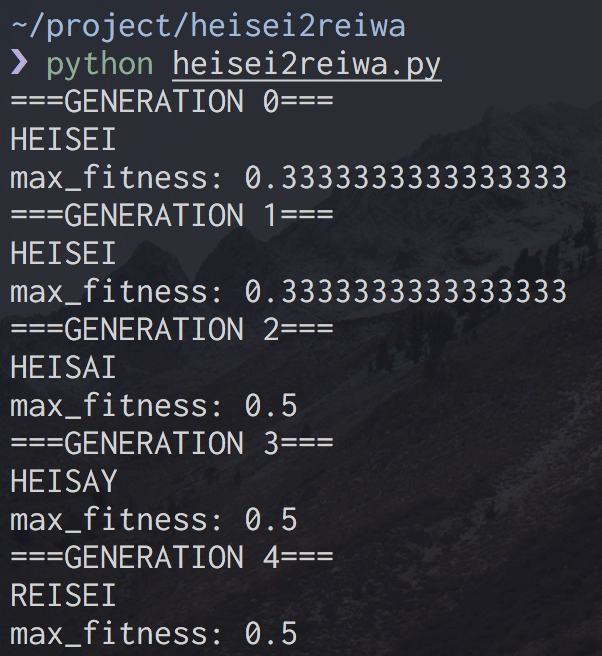
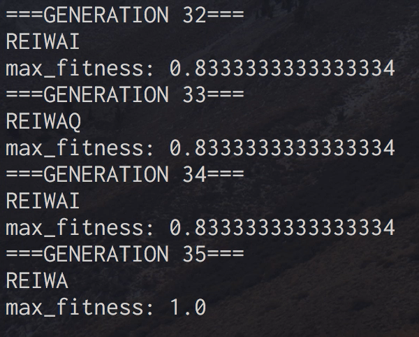

HEISEI to REIWA by Genetic Algorithm
===
A tool for changing from 'HEISEI' to 'REIWA' using genetic algorithm.

## Demo

### Start

### End

Japanese blog can be seen from the following link:  
https://upura.hatenablog.com/entry/heisei2reiwa

## Requirement
- Python 3.x
    - numpy

## License

[MIT](LICENSE)

## Author

[upura](https://github.com/upura)
